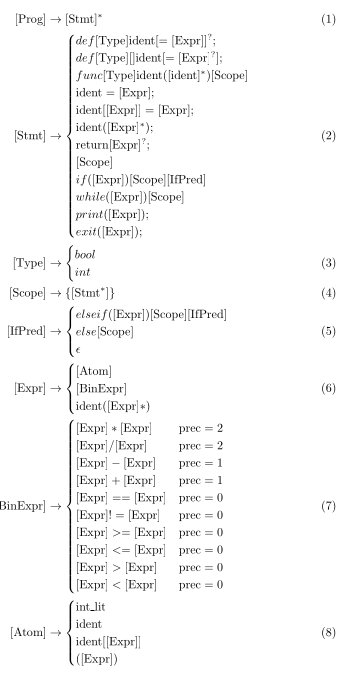

# Cobble language

This programming language was created as a learning project so that I can learn hands-on about compilers, compiler optimisations, using CMake and unit tests, assembly, lexing and abstract syntax trees,
immediate representations and much more. It is technically not meant to be used for anything; however, it can be, as it is Turing-complete, so one can technically do anything with it.

## Syntax

Everything here is mostly correct, as the changes since the last update have been **99%** additive.

Note:
    For functional purity, local variables are not accessible inside functions

## Try it

It is _quite_ hard to try it for now as the website is not hosted as i am still unsure what would be a good and free way to host the backend, i might just hook it up onto my raspberry but i am still unsure however you can still try it by either downloading this repo, compiling it with cmake or using the compiled compiler [cobble](/build/cobble) the argument list can be found in [main](/src/main.cpp) but its **./cobble <input-file> <output-path>** where the <input-file> is of the extension .cb. Or you can try it by going to <a href="https://github.com/RiciT/Cobble_WebEditor">the Web Editor repo<\a> and hosting both the front- and backends locally and then try it on the web interface, which is made with the Monaco editor and has the syntax supported. Hence, you have autocompletes, snippets, colouring, etc...
